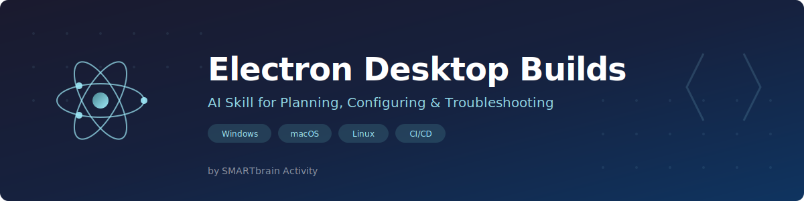

# 🖥️ Electron Desktop Builds — AI Skill for Antigravity · Claude Code · Gemini CLI · Cursor



[](https://www.smartbrainactivity.ai)
[](/LICENSE)
[](/scripts/audit-scan.js)
[]()
[]()
[]()
[]()
[]()
[]()

An expert AI skill for AI coding assistants (like Claude, Antigravity, Cursor, etc.) designed to help you plan, configure, and troubleshoot Electron desktop builds right from the chat or terminal.

[🇪🇸 Leer en Español](README.es.md)

---

## 🚀 Installation & Setup

To use this skill with your local AI coding assistant, clone this repository into your editor's "global skills" directory (e.g., `.gemini/antigravity/skills` or your environment's equivalent).

1. Open your terminal and navigate to your AI assistant's global skills folder.
2. Run the following command to download the skill:

```bash
git clone https://github.com/smartbrainactivity/electron-desktop-builds.git
```

3. (Optional but recommended) Audit the code using our embedded security scanner before running anything:

```bash
node electron-desktop-builds/scripts/audit-scan.js
```

4. Restart your AI chat. Now you can prompt: *"Help me package my React app as an Electron desktop build for Windows"*.

---

## What This Skill Does

This skill turns your AI assistant into an **Electron build expert** that follows a structured diagnostic approach:

1. **Clarifies the goal** — dev vs. production, target OS, packaging tool
2. **Reproduces the error** — asks for logs, configs, and environment details
3. **Checks compatibility** — verifies Node, Electron, and native module versions
4. **Isolates the problem** — categorizes the issue using its reference library
5. **Designs step-by-step fixes** — least invasive first, always reversible
6. **Explains reasoning** — so you learn, not just copy-paste

## Included Reference Guides

| Guide | Description |
|-------|-------------|
| **[Black Screen Debug](./references/electron-black-screen-debug.md)** | Detailed playbook for diagnosing empty/white/black screen issues |
| **[Builder Config](./references/electron-builder-config.md)** | Complete electron-builder templates — signed AND unsigned workflows |
| **[Code Signing](./references/electron-code-signing.md)** | Windows (.pfx, Azure Key Vault) and macOS (notarization) signing guides |
| **[Common Errors](./references/electron-common-errors.md)** | 10 known error patterns with proven solutions (including icon, symlink, Visual Studio) |
| **[Diagnostic Steps](./references/electron-diagnostic-steps.md)** | Systematic checklist for build failure triage |
| **[GitHub Actions](./references/electron-github-actions.md)** | Automated CI/CD workflows for multi-platform builds and releases |
| **[Icon Generation](./references/electron-icon-generation.md)** | JPEG-vs-PNG detection, rcedit workflow, all 10 icon locations, generation scripts |
| **[Release Checklist](./references/electron-release-checklist.md)** | 10-section pre-distribution checklist (icons, versions, debug cleanup, unsigned builds) |

## Scripts

| Script | Type | Description |
|--------|------|-------------|
| **[audit-scan.js](./scripts/audit-scan.js)** | Diagnostic | Static security scanner — verifies no malicious patterns |
| **[verify-icons.js](./scripts/verify-icons.js)** | Diagnostic | Icon format validator — detects JPEG-as-PNG, checks dimensions, warns about config |
| **[fix-exe-icon.js](./scripts/fix-exe-icon.js)** | Post-build | Automatic icon injection into `.exe` when `signAndEditExecutable: false`. Uses `rcedit` + rebuilds NSIS installer. **Copy to project and add to build chain.** |

### Using `fix-exe-icon.js`

This script permanently fixes the default Electron icon issue on unsigned Windows builds. Copy it to your project and add it to your build script:

```bash
# Copy to your project (or a shared scripts folder)
cp scripts/fix-exe-icon.js <your-project>/scripts/fix-exe-icon.js

# Append to electron:build in package.json
"electron:build": "... && electron-builder && node scripts/fix-exe-icon.js"
```

The script reads everything from `package.json` automatically (productName, win.icon, output directory). No hardcoded paths — works for any Electron app.

## Pre-Build Preflight Prompt (Optional)

Before building your installer, paste this prompt into your AI assistant. It will automatically check your project, ask for anything missing, and fix issues before you build:

<details>
<summary><strong>Click to expand the full preflight prompt</strong></summary>

```
Run a pre-build preflight check for my Electron app before I build the installer.

For each step, run the check automatically. If something fails, STOP and fix it before continuing.
If you need information from me, ASK before proceeding.

1. VERSIONS — Read package.json version, electron main file APP_VERSION constant, and any
   hardcoded version strings in the frontend (footer, about dialog). Confirm all match.
   Search: grep -r "v1\.0\.0" client/src/

2. ICON FORMAT — Run: file assets/icon.png (or wherever the icon is in build config).
   If output says "JPEG image data" instead of "PNG image data", convert it to real PNG.
   Check icon is at least 256x256. Check if old icon references (avatar.png) remain in components.

3. DEBUG CODE — Search for openDevTools in electron main file. Must ONLY run when isDev is true.
   Search for console.log debug statements and debug listeners (did-fail-load, console-message).
   Check <base href="./"> is not duplicated in index.html.

4. BUILD CONFIG — Verify build.files includes all required directories.
   If signAndEditExecutable: false, confirm rcedit step is planned.
   If npmRebuild: false, confirm no native modules are needed.
   Check installer.nsh install path is correct.

5. REPORT — Generate a summary table with OK/FAIL for each check.
   If all pass, give me the exact build commands (including rcedit if needed).
   If any fail, fix first, then show the updated report.
```

</details>

After the build completes, you can verify the output with:

```
Verify my Electron build: extract the icon from the .exe and confirm it's my app icon
(not the default Electron icon). If wrong, fix it with rcedit and rebuild the NSIS installer.
```

## Coverage

- **Build Tools**: electron-builder, electron-forge, electron-packager
- **Platforms**: Windows (NSIS installer), macOS (.dmg), Linux (.AppImage, .deb)
- **Frameworks**: React, Expo, vanilla Node.js projects
- **Topics**: asar packaging, preload scripts, native modules, auto-update, code signing, cross-platform builds, icon generation

## Requirements

- **Any AI Agent / IDE**: This skill is fully IDE-agnostic. It works with Claude Code, Antigravity, Gemini CLI, Cursor, and any assistant that supports skill loading.
- **No runtime dependencies**: This is a knowledge-only skill — no scripts to execute, no packages to install.

**🛡️ Privacy & Security Note**: This skill contains only markdown reference files and optional diagnostic scripts. There are no network requests and no telemetry. We strongly encourage you to inspect the source code before use.

**🔍 Static Audit Scanner**: This repository includes a native static analysis script (`scripts/audit-scan.js`) similar to Snyk/CodeQL. You can run `node scripts/audit-scan.js` at any time to verify that none of the executable logic contains malicious patterns (like `eval`, unauthorized HTTP requests, or destructive `child_process` commands).

## Language Agnostic

This skill adapts to your prompt's language automatically. You can instruct the AI in English, Spanish, or any other language, and the diagnostic guidance will follow your preferred language.

## Support & Contact

- **Creator**: SMARTbrain Activity
- **Website**: [www.smartbrainactivity.ai](https://www.smartbrainactivity.ai)
- **Email**: [hey@smartbrainactivity.ai](mailto:hey@smartbrainactivity.ai)

---

## Topics

electron · electron-builder · nsis · desktop-app · windows · macos · linux · code-signing · icon-generation · rcedit · ai-agents · gemini-cli · antigravity · claude-code · claude-code-skills · antigravity-tools · antigravity-skills

## License

[MIT License](LICENSE)
